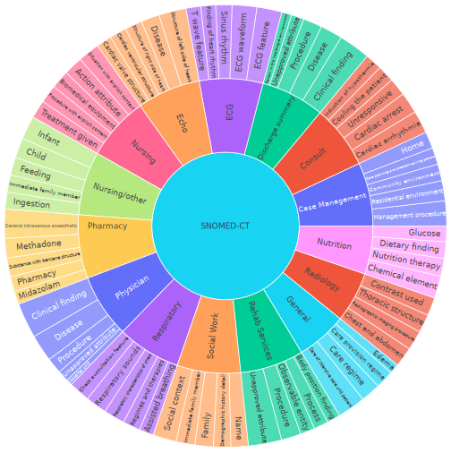

# Ontology-based constrained decoding - EKAW 2024

## Overview
This is the repository for the paper "Ontology-Constrained Generation of Domain-Specific Clinical Summaries" accepted at EKAW 2024. This method is a special domain adaptation technique based on dyanimc prompting and constrained beam search. The beam search algorithm is guided with an ontology.

## Prerequisites

You will need access to the following ressources :
- [MIMIC-III](https://physionet.org/content/mimiciii/1.4/) : Database of 1.4 million clinical notes regrouping over 40,000 admissions. Each admission is associated to multiple clinical notes written across various domains (Nursing, Radiology, ECG, ...). To have access to this database, you will need a PhysioNet account.
- [SNOMED-CT](https://www.snomed.org/) : The SNOMED-CT ontology is a medical ontology regrouping multiple medical domains. It determines a standard for medical terms.
  - You must have access to the .owx file. When downloading the ontology, it might not be given in an .owx format. Use a converter (e.g. protege) to get the .owx format.
- [MedCAT Annotator Tool](https://github.com/CogStack/MedCAT) : Annotator used to extract information from Electronic Health Records (EHRs). It links a sequence of characters to a concept in the SNOMED ontology.

## Getting started
Clone the repository
```
git clone https://github.com/Lama-West/Ontology-based-decoding_EKAW2024.git
cd Ontology-based-decoding_EKAW2024
```
Install requirements
```
pip install -r requirements.txt
```

## Prompt formats
All prompt formats are given in the file `src/prompts.py`.

### Extraction
The prompt used to extract information from a clinical note according to a given concept for all variants of the extraction step (greedy search, diverse beam search, our constrained decoding method) is given by :
```
"""Here is a clinical note about a patient : 
-------------------
{clinical_note}
-------------------
In a short sentence, summarize everything related to the "{concept}" concept mentioned the clinical note. {properties}. 

If the concept is not mentioned in the note, respond with 'N/A'.
"""
```

For example, if the concept is Tachycardia, the prompt would like like (note that we cannot put a real clinical note from MIMIC-III as it requires access to the database) : 
```
"""Here is a clinical note about a patient : 
-------------------
{clinical_note}
-------------------
In a short sentence, summarize everything related to the "Tachycardia" concept mentioned the clinical note. Tachycardia is characterized by heart rate increased. 

If the concept is not mentioned in the note, respond with 'N/A'.
"""
```

### Domain adaptation
For domain adaptation, the prompt format for the baselines (greedy search and diverse beam search) is :
```
Here are some clinical notes that were structured by concepts. Every sequence of '=' indicates a different note about the same patient made by a different clinician :

============
{CSR of clinical note 1}
============
{CSR of clinical note 2}
============
...
============

Summarize these clinical notes in a short text by focusing on concepts related to the {domain} domain.

```


As for our method, the prompt format is (note that we do not need to specify the domain since the pruning phase should take care of removing all irrelevant concepts): 
```
Here are some clinical notes that were structured by concepts. Every sequence of '=' indicates a different note about the same patient made by a different clinician :

============
{CSR of clinical note 1}
============
{CSR of clinical note 2}
============
...
============

Summarize these clinical notes in a short text.

```

### BHC Task
For the BHC task, the following prompt format is used for the baselines (greedy search, diverse beam search) :
```
Here are a patient's clinical notes separated by sequences of '='. 

===========
{clinical note 1}
===========
{clinical note 2}
===========
...
===========

In a short text, summarize the events occurring to the patient during the hospital stay, the surgical, medical and other consults the patient experienced and the hospital procedures the patient experienced.

```

For our method, this prompt format is used :
```
Here are a patient's clinical notes organized as a series of key-value pairs. Keys represent medical concepts and values provide specific details, observations, or interpretations about the patient related to the key.

===========
{CSR 1}
===========
{CSR 2}
===========
...
===========

In a short text, summarize the events occurring to the patient during the hospital stay, the surgical, medical and other consults the patient experienced and the hospital procedures the patient experienced.

```

## Inference
### Domain Class Frequency
To adapt a summary to a domain, we need to find the most frequent concepts for a certain domain. This analysis is performed by computing the frequencies of concepts in multiple texts from the same domain. On the MIMIC-III dataset, these are the most frequent concepts for each domain : 
<p align="center">
  
</p>

```python
# Load ontology
snomed_path = config.get('paths', 'snomed_ct')
snomed = SNOMED(snomed_path, cache_path='tmp/', nb_classes=366771)
```
```python
# Load annotator
annotator = MedCatAnnotator(
    medcat_path, 
    snomed,
    meta_cat_config_dict={
        'general': {
            'device': model.device.type
        }
    }
)
```
```python
# Group texts by domain (CATEGORY column in MIMIC-III).
category_attributes = df.groupby('CATEGORY')['TEXT'].apply(
    lambda texts: [attr for text in texts for attr in annotator.annotate(text)]
).to_dict()

analysis = DomainClassAnalysis(snomed, category_attributes, normalize_with_average=True)

print(Counter(analysis.domain_class_frequencies['Nursing'].frequencies).most_common(5))
# 5 most frequent concepts of Nursing category
```

### Extraction (constrained decoding)
Assuming that these variables are set :
- `model_path` : Huggingface checkpoint (local)
- `snomed_path` : Path to .owx of snomed ontology
- `medcat_path` : Path to medcat annotator
```python
# Load model
model, tokenizer = load_hf_checkpoint(model_path, padding_side='left', use_quantization=True, device_map={"": 0})
```
```python
# Load ontology
snomed_path = config.get('paths', 'snomed_ct')
snomed = SNOMED(snomed_path, cache_path='./', nb_classes=366771)
```
```python
# Load annotator
annotator = MedCatAnnotator(
    medcat_path, 
    snomed,
    meta_cat_config_dict={
        'general': {
            'device': model.device.type
        }
    }
)
```
```python
# Configuration for inference
config = DiverseBeamSearchConfig()
config.use_scorer = True

constrained_model = OntologyConstrainedModel(
    model, 
    tokenizer, 
    snomed=snomed, 
    annotator=annotator, 
)

prompter = OntologyBasedPrompter(
    constrained_model,
    snomed_ct=snomed,
    annotator=annotator, 
)

prompter.start_multiple(
    clinical_notes, # List of clinical notes 
    batch_size=..., # Number of concepts to treat in parallel
    top_n=..., # Number of concepts to extract per note
    generation_config=config,
)

print(prompter.attributes) 
# [ 
#   {'Procedure': ..., 'Clinical finding': ...} # Note 1
#   {'Observable entity': ...} # Note 2
#   ...
# ]
```


### Pruning and Verbalizer
Assuming that the attributes were extracted (in a DataFrame) and that the domain adaptation analysis was performed.
```python
dcfs = ... # Domain class frequencies
verbalizer = DomainOntologyBasedVerbalizer(
    output_path=..., # Output path
    domain_analysis=dcfs,
    snomed=snomed,
    annotator=annotator,
    model=model,
    tokenizer=tokenizer,
)

verbalizer.start(
    structured=results, # DataFrame containig the results
    pre_prompt=DOMAIN_PRE_PROMPT,
    post_prompt=DOMAIN_POST_PROMPT,
    text_column='notes',
    summary_column='bhc', # If for BHC
    domain_filter=['Nursing', 'Physician ', 'Radiology', 'ECG']
)

```

# Resources
LAMA-WeSt lab: http://www.labowest.ca/
